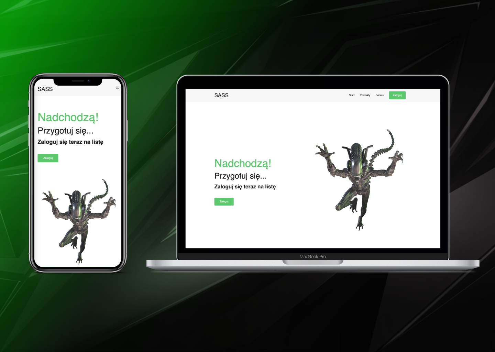

# SASS - project tutorial from Brian Design

This is a static site created and inspired from a YT exercise by Brian Design.

## Link to tutorial
"Build a Responsive Website Using HTML & SASS/SCSS Tutorial"
### https://www.youtube.com/watch?v=pk-MEjUINjI&ab_channel=BrianDesign

## Link to my project
### http://oblivion.rf.gd/?i=2

## Preview

## Description
Thanks to this exercise, I quickly learned the principles of SASS design. Besides, the site is not that big and it brought me a lot of fun.

Thank you Brian Design :)

## Knowledge of technology
* HTML
* CSS
* Bootstrap
